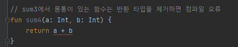
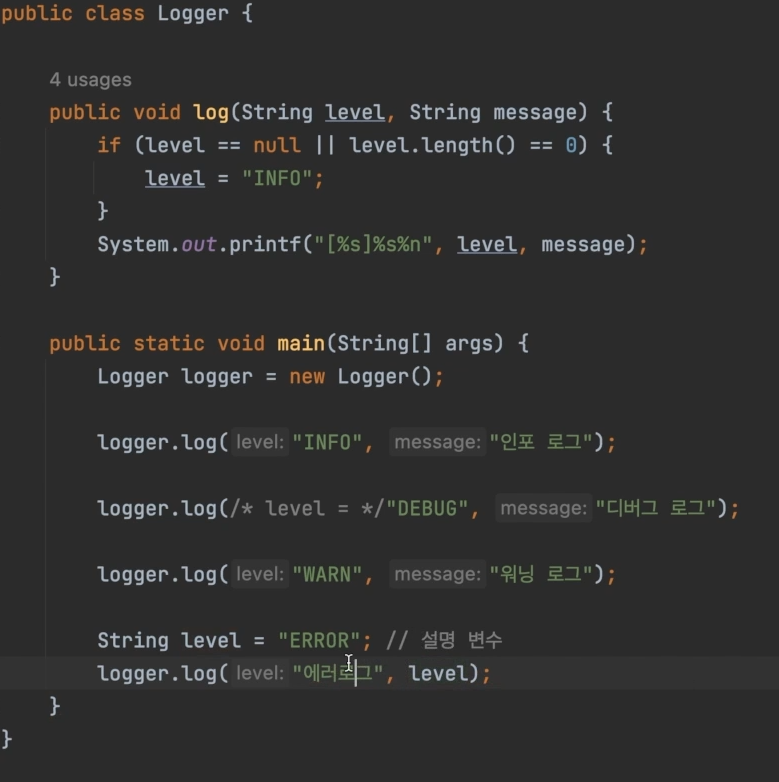

# 함수 (function)

## 함수 선언

### 반환타입이 있는 함수
> 반환타입이 있는 함수 - fun 메소드명(아규먼트명: 데이터타입) 반환타입 {} 
```kotlin
fun sum(a: Int, b: Int): Int {
    return a + b
}
```

### 반환타입이 없는 함수
> Unit은 자바에서 void를 뜻한다 하지만 코틀린에서는 생략도 가능하다.
```kotlin 
fun printSum(a: Int, b: Int): Unit {
    println(a + b)
}
```

### 표현식 스타일 함수
> body가 없는 형태로 작성이 가능하다.
```kotlin
//표현식 스타일
fun sum2(a: Int, b: Int): Int = a + b

//표현식 & 변환타입 생략
fun sum3(a: Int, b: Int) = a + b

```

> 만약 sum3에서 바디를 만들었다면 아래 코드처럼 형태가 된다 하지만 에러가 발생한다. 바디가 있는데 반환을 한다면 반환타입을 정해줘야한다.

  

```kotlin
fun sum4(a: Int, b: Int) Int {
    return a + b
}
```


---

## 디폴트 파라미터
> 코틀린에서는 아래와 같이 디폴트값을 지정할 수 있다.
```kotlin
fun greeting(message: String = "안녕하세요") {
    println(message)
}

fun main() {
    greeting()  // 안녕하세요
    greeting("hi")  // hi
}
```  

<br>
  
> 위 코드를 자바로 작성한다면 아래와 같은 코드가 나온다.
```java
class main {
	public void print(String message) {
		if (message == null || message.equals("")){
			message = "안녕하세요";
		}

		System.out.println(message);
	}
}
```

---

## 네임드 아규먼트
> 아규먼트의 순서가 변해도 명칭만 맞다면 알맞게 값이 할당된다.
```kotlin
fun log(level: String = "INFO", message: String) {
    println("[$level]$message")
}

/**
 * 네임드 아규먼트
 * */
fun main(){
    log(message = "인포로그")
    log(level = "DEBUG", "디버그 로그")
    log("WARN", "워닝로그")
    
    log(message = "에러", level = "ERROR")  // 파라미터 순서가 변해도 log함수에는 알맞게 들어가기된다.
}
```

<br>   

> 위 코드를 자바로 작성하게된다면 아래와 같이 작성해야하며 더불어 파라미터 순서가 바뀌면 컴파일에러가 발생한다.  



